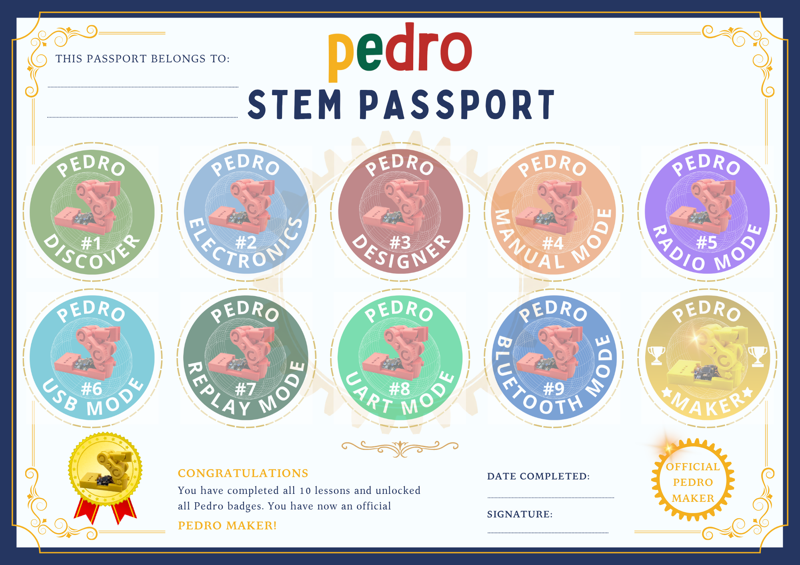
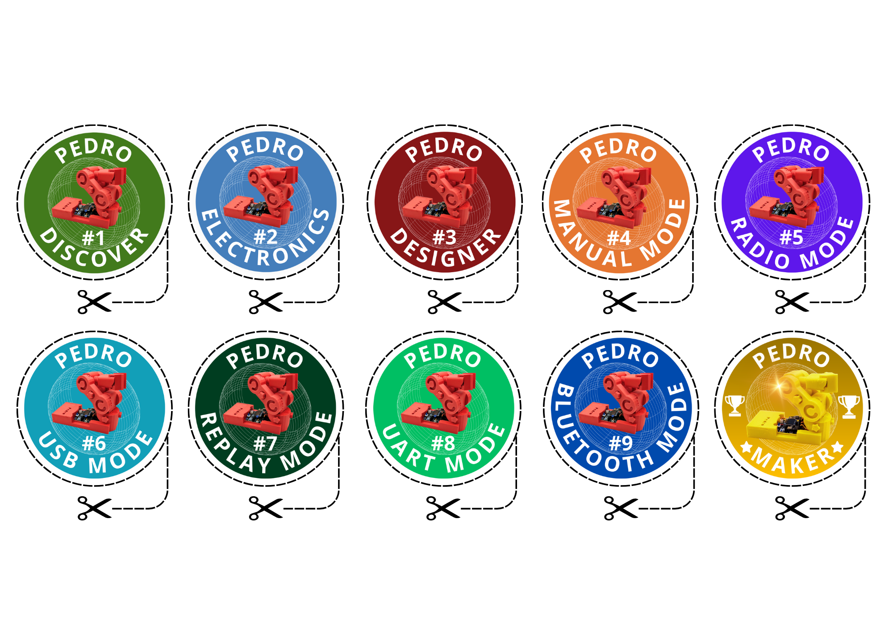

## 🚀 Pedro Project Repositories: 
Each Pedro repository serves a specific role in the ecosystem:

* 📂 [`Pedro 3D Files`](https://github.com/almtzr/Pedro3DFiles): STL files for printing Pedro robot.
* 📂 [`Pedro Board`](https://github.com/almtzr/PedroBoard): Gerber files, schematics, and PCB layouts for the Pedro controller board.
* 📂 [`Pedro Firmware`](https://github.com/almtzr/PedroFirmware): Firmware and library to program and control the Pedro robot.
* 📂 [`Pedro STEM Lessons`](https://github.com/almtzr/PedroSTEMLessons): STEM lessons, activities, and teaching material using the Pedro robot for schools.

# 📂 `Pedro STEM`

## Complete all 10 Pedro STEM Lessons, collect every Pedro Badge, and become an official PEDRO MAKER! 🏆

     

     

 
 

    
    

    
    

    
    

    
    

    
    

